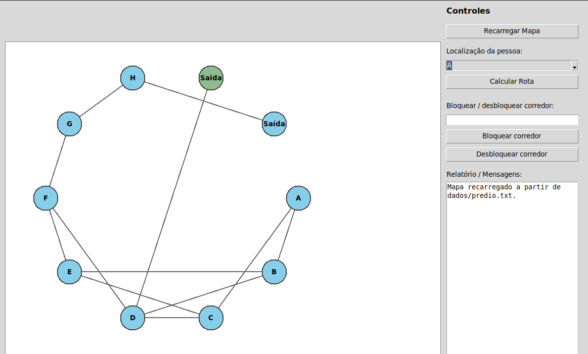
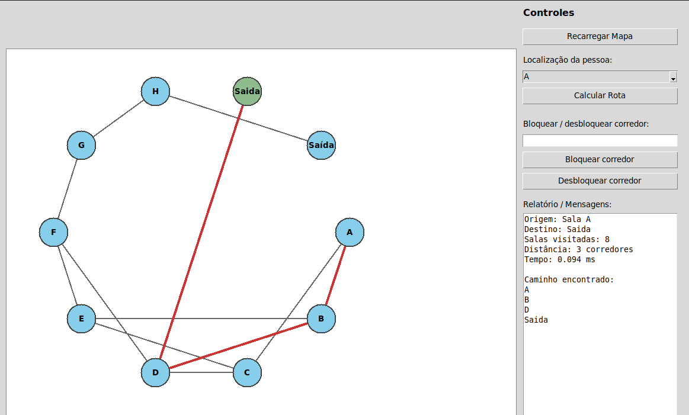
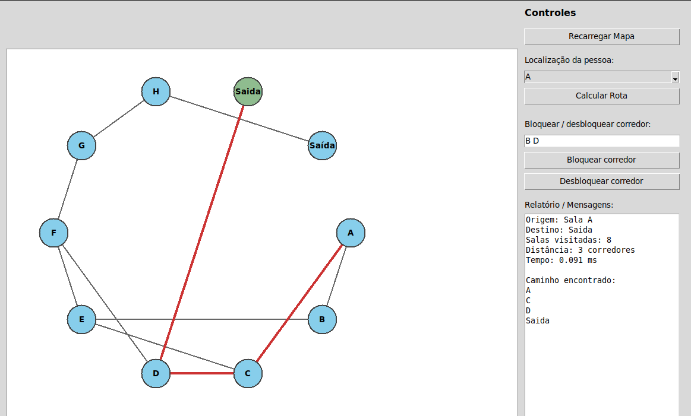

# Sistema de Evacuação Inteligente de Prédios

**Número da Lista:** 22  
**Disciplina:** Estruturas de Dados II

## Alunos

| Matrícula | Aluno |
|-----------|--------|
| 211061903 | Isaque Santos |
| 200023985 | Maria Eduarda dos Santos Marques |

## Sobre

Sistema desenvolvido em **Python** para simular a evacuação de um prédio durante uma emergência utilizando **Busca em Largura (BFS)** como algoritmo principal.

O projeto representa o prédio como um grafo não ponderado, onde cada sala é um vértice e cada corredor é uma aresta. O objetivo é encontrar o menor caminho entre a sala em que a pessoa se encontra e a saída mais próxima, preservando a estrutura do grafo por lista de adjacência.

A principal motivação para a escolha do BFS é sua capacidade de encontrar a rota com o menor número de corredores em grafos não ponderados.

---

## Screenshots

Tela inicial do programa



Tela de exibição do mapa e rota de fuga



Tela de exibição do mapa e rota de fuga com bloqueio (corredor em chamas)



---

## Vídeo da apresentação 

[clique aqui para assistir](https://youtu.be/Ek5AteWdXDU)

## Instalação

### Pré-requisitos

- Python 3.x
- Terminal ou Prompt de Comando

### Execução

No diretório do projeto:

```bash
cd EvacuacaoPredio
python main.py
```

Ou para iniciar a interface gráfica:

```bash
python main.py gui
```

---

## Algoritmo Utilizado

### Busca em Largura (BFS)

O projeto usa BFS para encontrar a saída mais próxima a partir da sala informada pelo usuário. Como o prédio é modelado como um grafo não ponderado, a busca visita primeiro as salas mais próximas e só depois avança para as demais.

O algoritmo trabalha com uma fila, um conjunto de salas visitadas e um registro de predecessores. Esses predecessores permitem reconstruir o caminho completo depois que uma saída é encontrada.

Na prática, isso significa que:

- a busca começa na sala de origem;
- cada sala visitada é marcada para evitar repetição;
- os corredores bloqueados deixam de ser considerados na rota;
- a primeira saída alcançada representa o menor caminho em número de corredores.

Por esse motivo, o BFS é adequado para simular evacuação: ele é simples, eficiente e encontra rapidamente uma rota válida quando existe caminho até uma saída. Em termos de complexidade, o custo é proporcional ao número de salas e corredores do prédio.

